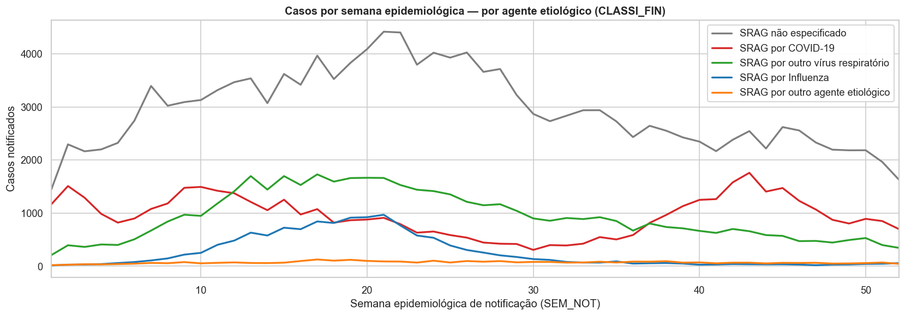
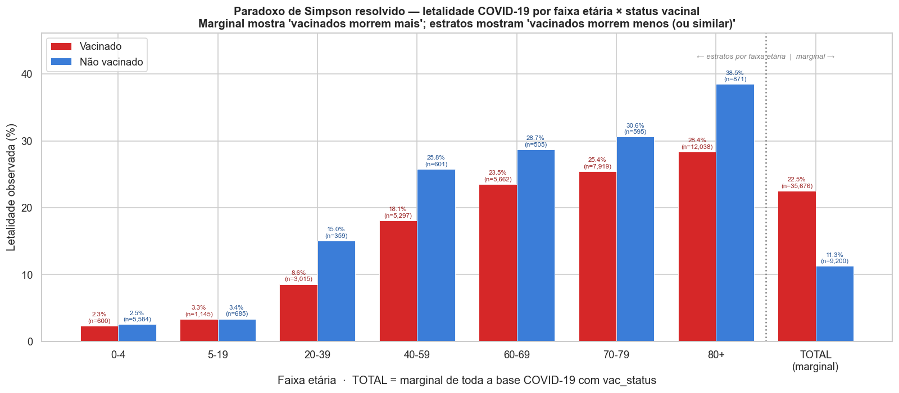
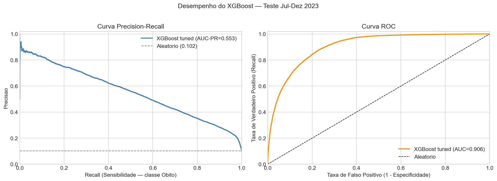
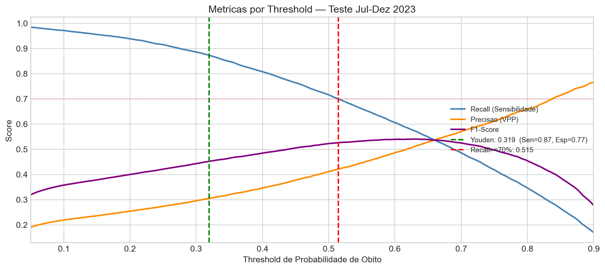
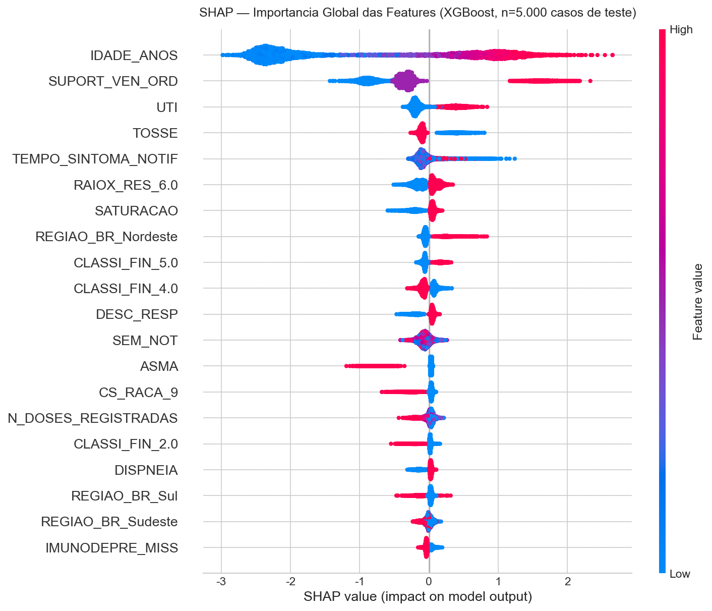
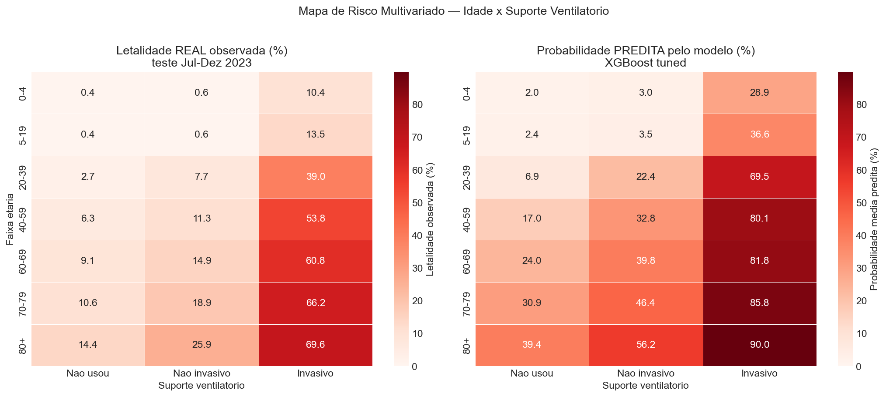
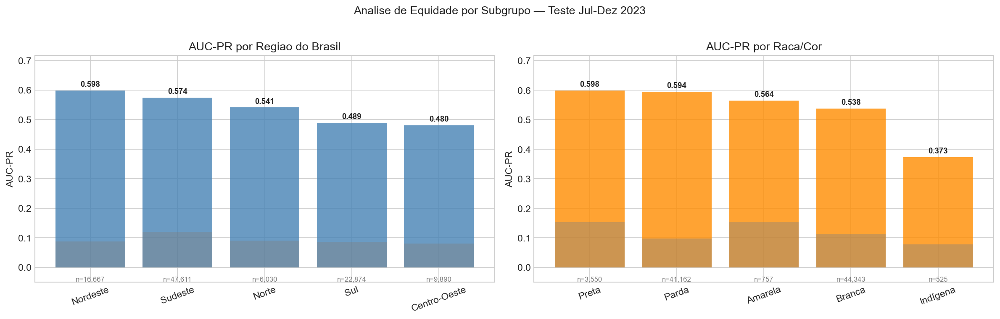

\newpage

# Sumário executivo

Este relatório documenta a análise da base **SRAG 2023** (Síndrome Respiratória Aguda Grave) do Open Data SUS / SIVEP-Gripe, abrangendo 279.453 registros de notificações em 2023. O trabalho foi conduzido em oito fases, do setup à entrega final, e produziu quatro resultados principais: um pipeline de limpeza reproduzível, uma EDA descritiva com 19 figuras, um modelo preditivo de evolução de caso (óbito ou cura) e cinco recomendações de saúde pública derivadas dos achados.

O modelo final é um XGBoost com hiperparâmetros otimizados que atinge AUC-PR de 0,5531 e AUC-ROC de 0,9055 no teste temporal de julho a dezembro de 2023. O resultado corresponde a aproximadamente 5,5 vezes o baseline aleatório (taxa-base de óbito em torno de 10%).

O achado central da análise pode ser resumido em uma linha: 2023 foi um ano de SRAG pediátrica em volume e SRAG idosa em letalidade. O pico anual ocorreu em maio (35.248 casos na semana epidemiológica 21) e foi puxado por VSR e Influenza em crianças com menos de 5 anos, enquanto a letalidade é dominada por idosos a partir dos 70 anos, chegando a 27,7% no grupo de 80+.

Em termos de recomendação de saúde pública, a maior alavanca de redução de óbitos não está na otimização adicional do modelo (já em 5,5 vezes o baseline), mas em três frentes complementares: reforço da capacidade pediátrica antes do pico anual de VSR; busca ativa de idosos a partir de 70 anos com cobertura vacinal incompleta; e padronização da qualidade do preenchimento das fichas SIVEP-Gripe entre estados.

\newpage

# 1. Contexto e problema

## 1.1 Enunciado

O desafio técnico solicitou análise da base SRAG 2023 do SIVEP-Gripe com quatro entregáveis:

1. **Tratamento de dados** — identificar e corrigir problemas, documentando todas as etapas.
2. **Análise descritiva** — atributos principais, tendências temporais, distribuição geográfica, fatores de risco e comorbidades.
3. **Modelos de ML** — prever a evolução do caso (óbito ou cura), com transparência sobre métricas e tradeoffs.
4. **Conclusão** — insights e recomendações de intervenções de saúde pública.

## 1.2 Dataset

- **Fonte:** Open Data SUS / SIVEP-Gripe — ficha de notificação compulsória de SRAG em hospitais brasileiros.
- **Tamanho bruto:** 279.453 linhas e 194 colunas (22 MB em Parquet zstd).
- **Período:** notificações de 2023, com pequena fração até jun/2025 (descartada na Fase 2).
- **Variáveis-chave:** datas de sintoma, notificação e internação; demografia (idade, sexo, raça, UF); sintomas; comorbidades; vacinação COVID; cuidado hospitalar (UTI, suporte ventilatório); agente etiológico; e o desfecho (`EVOLUCAO`).

## 1.3 Decisões metodológicas centrais

| Decisão | Escolha | Justificativa |
|---|---|---|
| Estrutura | Híbrida (notebooks + módulo `src/`) | Notebooks concentram a narrativa; módulos reúnem lógica reutilizável e testável |
| Storage | Parquet zstd | Cerca de 14 vezes menor que CSV; carregamento muito mais rápido |
| Target | `EVOLUCAO ∈ {1=Cura, 2=Óbito SRAG}` binário | Pergunta do desafio; descarte das categorias 3 e 9 por ruído e incerteza |
| Métrica primária | AUC-PR | Óbito é a classe rara (cerca de 10%); AUC-PR é mais sensível ao desempenho na classe minoritária |
| Split | Temporal (Jan-Jun em treino, Jul-Dez em teste) | Simula uso real e capta o shift de composição etiológica (VSR a COVID) |
| Vazamento | Exclusão de `DT_EVOLUCA`, `DT_ENCERRA` e `CRITERIO`; manutenção de `UTI`, `SUPORT_VEN` e `RAIOX_RES` | Variáveis hospitalares são registradas antes do desfecho, com uso clínico legítimo |
| Imbalance | `class_weight='balanced'` e `scale_pos_weight=9` | Mais simples e robusto que SMOTE em dados tabulares |
| Reprodutibilidade | `random_state=42` fixo em `config.py` | Seed única importada por todos os módulos |

\newpage

# 2. Tratamento de dados (Fase 2)

## 2.1 Etapas executadas

1. **Filtro temporal:** 3.114 linhas (1,1%) fora de 2023 foram descartadas.
2. **Drop de colunas:** 28 colunas removidas (7 totalmente vazias e 21 constantes).
3. **Casting conservador:** 21 colunas `object` (com `Decimal` mascarado) convertidas para numérico apenas quando 100% dos valores não nulos foram passíveis de parsing.
4. **Idade unificada:** `NU_IDADE_N + TP_IDADE` foi convertido para `IDADE_ANOS` (com 1=dias, 2=meses, 3=anos) e clip em [0, 120]; 7 valores aberrantes foram transformados em NaN.
5. **Binárias `{1,2,9} → {1,0,NaN}`:** o sinal de "ignorado" é preservado como missing.
6. **Decode categórico paralelo:** os códigos numéricos foram preservados (`CLASSI_FIN`) e os rótulos legíveis ficaram em coluna `_LABEL` separada (`CLASSI_FIN_LABEL`).
7. **Output:** `data/interim/srag_2023_clean.parquet` (276.339 × 185 colunas, 19 MB).

## 2.2 Decisões deliberadamente adiadas

- **Imputação de missing:** não foi feita na Fase 2 porque depende de fit em treino, o que abriria risco de data leakage. Ficou encapsulada no `Pipeline` do sklearn (Fase 4).
- **Filtro do target `EVOLUCAO ∈ {1,2}`:** não foi aplicado ao parquet persistido porque a EDA (Fase 3) precisa do universo completo. Aplica-se via `filter_modeling_target` na Fase 4.

## 2.3 Qualidade do código

- **`src/maxpar_srag/cleaning.py`:** 10 funções puras e `clean_pipeline()` para encadeamento.
- **`tests/test_cleaning.py`:** 29 testes pytest passando (0,58s).
- **Princípio:** cada decisão de tratamento tem um markdown explicativo no notebook 02, justificando a escolha além da descrição do que foi feito.

\newpage

# 3. Análise descritiva (Fase 3)

Os 19 painéis cobrem as nove dimensões do enunciado. Os achados mais relevantes para política pública estão listados a seguir.

## 3.1 Pico de SRAG em 2023 foi pediátrico

A onda de **maio/2023 (semana epidemiológica 21)** registrou 35.248 casos, o maior pico anual. Diferentemente de 2020 a 2022, o vetor principal foi **VSR e Influenza em crianças com menos de 5 anos**, e não COVID. O pico de COVID ocorreu na SE 43 (out/nov), com magnitude bem menor.

Em magnitude, 42% dos casos SRAG 2023 estão na faixa **0-4 anos** (62 mil registros em meses, 3 mil em dias e 53 mil em anos com menos de 5). A mediana de `IDADE_ANOS` é de 8 anos.

{width=85%}

## 3.2 Gradiente etário fortíssimo na letalidade

A letalidade SRAG cresce monotonicamente da infância à terceira idade:

| Faixa | Letalidade observada |
|---|---|
| 0-4 anos | 1,2% |
| 5-19 anos | 1,5% |
| 20-39 anos | 8,9% |
| 40-59 anos | 17,0% |
| 60-69 anos | 21,4% |
| 70-79 anos | 23,9% |
| 80+ anos | 27,7% |

A variação total é de 23 vezes. Isoladamente, a idade é o preditor mais forte de mortalidade.

## 3.3 Paradoxo de Simpson na vacinação COVID, resolvido

A análise marginal, sem controlar pela idade, sugere que vacinados teriam letalidade maior que não vacinados (22,5% contra 11,3%, diferença de 11pp). Trata-se de um artefato: os vacinados são, em média, mais velhos.

Ao estratificar por faixa etária, o efeito da vacinação é protetor em todos os estratos com n maior ou igual a 100:

| Faixa | Vacinado − Não vacinado |
|---|---|
| 20-39 anos | −6,5pp |
| 40-59 anos | −7,7pp |
| 60-69 anos | −5,2pp |
| 70-79 anos | −5,1pp |
| 80+ anos | −10,1pp |

O heatmap idade × doses confirma a resposta-dose: em 80+ anos, a letalidade cai de 36,8% (0 doses) para 26,1% (4 doses), com gap real de 10pp.

{width=85%}

A implicação metodológica é direta: o caso é um exemplo livro-texto de confundimento etário e justifica modelagem multivariada e cuidado com tabelas marginais, uma armadilha comum em comunicação de saúde pública.

## 3.4 Cuidado hospitalar como sinal de gravidade

Letalidade observada por modalidade de suporte:

| `SUPORT_VEN` | Letalidade |
|---|---|
| Invasivo | 40,95% |
| Não invasivo | 7,44% |
| Não usou | 4,07% |

UTI: 18,66% contra 5,79% (3,2 vezes a letalidade).

## 3.5 Comorbidades raras e graves têm efeito mais limpo

A análise univariada mostra cardiopatia com letalidade alta (23,1% contra 13,9%, gap de 9pp). Mas, ao estratificar por idade, o gap praticamente desaparece em adultos e idosos: em 70-79 anos, a letalidade com cardiopatia é de 24,4% contra 26,8% sem cardiopatia (gap de −2,4pp). O mesmo se aplica a diabetes.

Comorbidades com efeito independente mais forte (que sobrevivem à estratificação por idade) são as raras e graves: hepática (30%), renal (27%) e imunodepressão (24%).

\newpage

# 4. Feature engineering (Fase 4)

## 4.1 Decisão de vazamento

A decisão metodologicamente mais importante da Fase 4 trata de vazamento de informação. O dataset SIVEP contém colunas temporariamente posteriores ao desfecho ou que revelam o desfecho diretamente:

- **Excluídas:** `DT_EVOLUCA` (data de cura ou óbito), `DT_ENCERRA` (data de fechamento da ficha) e `CRITERIO` (critério de classificação final, calculado pós-desfecho).
- **Mantidas:** `UTI`, `SUPORT_VEN_ORD` (ordinal derivado de `SUPORT_VEN`) e `RAIOX_RES`, todas registradas antes do desfecho e clinicamente relevantes para o quadro do paciente.

Um modelo de triagem na chegada teria features ainda mais restritas (sem `UTI` e sem `SUPORT_VEN_ORD`), mas trata-se de um modelo separado.

## 4.2 Pipeline de features

- **45 features finais** após codificação (binárias, ordinais, OHE para nominais e scaler para numéricas).
- **`StandardScaler`** nas features numéricas, necessário para a Regressão Logística usada como baseline.
- **Cap de outlier** em `TEMPO_SINTOMA_NOTIF ≤ 30 dias`: o desvio-padrão do teste caiu de 18,6 para 6,1.
- **8 indicadores `_MISS`** para comorbidades com cerca de 70% de missing, que capturam o sinal de "não avaliado" como sinal real, distinto de "ausente".
- **Feature composta:** `RESP_SEVERIDADE` (cluster de sintomas dispneia, desconforto respiratório e saturação abaixo de 95%, identificado por correlação Pearson de 0,31 a 0,37).

## 4.3 Split temporal

- **Treino:** Jan-Jun/2023 — 145.407 casos, taxa de óbito de 9,7%.
- **Teste:** Jul-Dez/2023 — 103.072 casos, taxa de óbito de 10,2%.

A composição etiológica difere entre os semestres (VSR e Influenza predominam no primeiro; pico de COVID ocorre no segundo). É uma forma natural de avaliar robustez a shift de distribuição.

\newpage

# 5. Modelagem (Fase 5)

## 5.1 Modelos comparados

Oito configurações foram avaliadas por CV 5-fold no treino:

| # | Modelo | Papel |
|---|---|---|
| 1 | DummyClassifier | Piso mínimo (estratificado) |
| 2 | Regressão Logística | Baseline linear interpretável (`class_weight='balanced'`, `C=0.1`) |
| 3 | Random Forest (default e tuned) | Bagging — robusto a outliers e ruído |
| 4 | XGBoost (default e tuned) | Boosting — historicamente dominante em tabular |
| 5 | LightGBM (default e tuned) | Boosting leaf-wise — mais rápido |

## 5.2 Tuning de hiperparâmetros (Optuna TPE)

- **Algoritmo:** TPE (Tree-structured Parzen Estimator), bayesiano, que aprende a distribuição de hiperparâmetros promissores.
- **CV interna por trial:** 3-fold em subset do treino (60 a 100 mil linhas), o que preserva a ordenação relativa a um custo menor.
- **Configuração final:** Random Forest com 50 trials (60 mil); XGBoost com 80 trials (100 mil); LightGBM com 80 trials (100 mil).
- **Avaliação final:** CV 5-fold no treino completo (145 mil) para estimativa honesta.

## 5.3 Resultados no teste temporal (Jul-Dez 2023)

O melhor modelo foi o XGBoost com tuning.

| Métrica | Valor | Baseline aleatório |
|---|---|---|
| AUC-PR | 0,5531 | 0,102 (taxa de óbito) — 5,4 vezes |
| AUC-ROC | 0,9055 | 0,500 |
| Brier Score | 0,0915 | 0,0916 |

{width=95%}

\newpage

# 6. Avaliação e interpretação (Fase 6)

## 6.1 Threshold operacional

O threshold padrão (0,5) raramente é ótimo em problemas desbalanceados. As alternativas avaliadas:

| Threshold | Estratégia | Sen | Esp | Prec | F1 |
|---|---|---|---|---|---|
| 0,319 | Youden's J | 0,873 | 0,774 | 0,305 | 0,452 |
| 0,515 | Recall ≥ 70% | 0,700 | — | 0,422 | 0,526 |
| 0,500 | Padrão | 0,713 | — | 0,415 | 0,524 |

A escolha do threshold depende do uso:

- **Triagem de risco na entrada hospitalar:** Youden (0,319), com alta sensibilidade (87,3%) como prioridade. Aceita três falsos positivos para cada verdadeiro positivo, em troca de minimizar óbitos perdidos.
- **Alerta clínico para escalonamento:** Recall ≥ 70% (0,515), com melhor F1 (0,526) e precisão razoável (42%). Reduz a fadiga de alerta.

{width=85%}

## 6.2 SHAP — importância global das features

O TreeExplainer foi aplicado a 5.000 amostras do teste. As principais features são:

1. **`SUPORT_VEN_ORD`** — suporte ventilatório invasivo (confirma a EDA: 40,95% contra 4,07%).
2. **`UTI`** — internação em UTI (3,2 vezes a letalidade de quem não usou UTI).
3. **`IDADE_ANOS`** — gradiente monotônico de risco.
4. **Comorbidades raras e graves** — hepática, renal e imunodepressão (top-10 acumulado).
5. **`SEM_NOT`** — semana epidemiológica (sazonalidade e pressão sobre o sistema).

{width=85%}

## 6.3 Calibração e discriminação

Embora a AUC-ROC seja de 0,91 (discriminação elevada), o Brier Score de 0,0915 é praticamente idêntico ao baseline ingênuo de 0,0916. Em outras palavras, o modelo ranqueia muito bem, mas as probabilidades absolutas estão mal calibradas.

O mapa de risco multivariado idade × suporte ventilatório torna isso visualmente claro: a célula 80+ × Invasivo tem letalidade real de 69,6%, mas o modelo prevê 90,0%, uma superestimação de cerca de 20pp.

{width=95%}

Na prática, o modelo pode ser usado para ranquear pacientes em triagem (uso interno), mas as probabilidades absolutas não devem ser comunicadas a leigos sem recalibração posterior (Platt scaling ou regressão isotônica).

## 6.4 Equidade por subgrupo

A AUC-PR foi comparada ao baseline aleatório de cada subgrupo (taxa de óbito local):

- **Faixa etária:** o desempenho varia. Em 0-4 anos a AUC-PR é menor em valor absoluto, mas o baseline também é menor (1,2%), de modo que o modelo está mais próximo do ótimo possível.
- **Região:** o desempenho é relativamente uniforme nas cinco regiões, sem colapso em nenhuma.
- **Raça/cor:** não há disparidade dramática nas categorias com n maior ou igual a 200, mas a métrica deve ser monitorada em uso real.

{width=95%}

\newpage

# 7. Recomendações de saúde pública

Cinco intervenções derivadas dos achados, cada uma com racional, responsável e impacto esperado.

## 7.1 Reforçar capacidade pediátrica de SRAG

**Racional:** 42% dos casos SRAG 2023 estão em menores de 5 anos. O pico de maio/2023 (35 mil casos por semana) foi pediátrico. A capacidade adulta abundante no pós-pandemia não cobre essa carga.

**Ação:**

- Mapeamento de leitos pediátricos de UTI e clínicos disponíveis por região e simulação do pico de VSR (modelo histórico SE 17-21).
- Ampliação dos protocolos de transferência inter-municipal para evitar saturação local em capitais de menor porte.
- Vacinação infantil contra Influenza com cobertura ampliada antes de abril.

**Responsável:** secretarias estaduais de saúde e Ministério da Saúde (DGSI).

## 7.2 Priorização vacinal por perfil idade × comorbidade

**Racional:** o paradoxo de Simpson mostrou que a vacinação protege em todos os estratos, com maior magnitude absoluta em 80+ (gap real de 10pp). A cobertura em maiores de 70 anos com 4+ doses ainda é desigual.

**Ação:**

- Cruzamento dos registros do PNI (Programa Nacional de Imunização) com cadastros do SUS para identificar idosos a partir de 70 anos com menos de quatro doses e priorizar a busca ativa.
- Priorização de comorbidades raras e graves (renal, hepática, imunodepressão) para reforço anual, independentemente da idade.
- Comunicação com linguagem estratificada por idade, evitando tabelas marginais confundidoras.

**Responsável:** PNI / Ministério da Saúde e Atenção Primária.

## 7.3 Sistema de alerta antecipado

**Racional:** o modelo (AUC-ROC de 0,91) discrimina muito bem quem morre. Combinado com `SEM_NOT`, pode ser usado para alertar antecipadamente quais semanas e UFs concentram maior pressão.

**Ação:**

- Pipeline semanal: a cada segunda-feira, o modelo processa as fichas SIVEP da semana anterior e emite um "score regional de SRAG" — média das probabilidades preditas ponderada pelo volume.
- Painel público nos moldes do InfoGripe (Fiocruz) com previsão de pico de 2 a 4 semanas à frente.
- Threshold operacional de Youden (0,319) para acionar alertas em UFs específicas.

**Responsável:** Centro de Operações de Emergências (COE) e Fiocruz / InfoGripe.

## 7.4 Padronização da qualidade do registro SIVEP-Gripe

**Racional:** os cerca de 70% de missing em comorbidades não significam que os pacientes não as tinham; significam que a ficha foi preenchida apressadamente. A disparidade de letalidade por UF (AP 2,4% contra TO 21,8%) é parcialmente explicada pela qualidade do registro, e não apenas pela qualidade do cuidado.

**Ação:**

- Auditoria amostral mensal de fichas SIVEP por UF, com meta de menos de 30% de campos "Ignorado" em comorbidades-chave.
- Treinamento dos profissionais de notificação em hospitais com piores indicadores de qualidade.
- Uso dos indicadores `_MISS` como sinal de qualidade do hospital, e não apenas como feature do modelo.

**Responsável:** SVS / MS e secretarias estaduais.

## 7.5 Pesquisa direcionada: SRAG por outro agente etiológico em idosos

**Racional:** casos com `CLASSI_FIN=3` (n próximo de 3,6 mil) têm letalidade desproporcional em maiores de 70 anos (54 a 55%). Há possibilidade de coinfecções bacterianas pós-virais ou agentes raros e graves.

**Ação:**

- Estudo retrospectivo dirigido, com revisão de prontuário em 200 a 300 dessas fichas.
- Coleta sistemática de cultura e PCR ampliado nos casos a partir de 70 anos com SRAG e teste viral negativo.
- Avaliação de protocolo de antibioticoterapia empírica precoce em SRAG 70+ enquanto o agente é investigado.

**Responsável:** Instituto Evandro Chagas, redes de hospitais universitários e Sociedades de Pneumologia e Geriatria.

\newpage

# 8. Limitações e próximos passos

## 8.1 Limitações conhecidas

1. **Qualidade do registro SIVEP-Gripe.** Os cerca de 70% de missing em comorbidades degradam tanto a EDA quanto o modelo. Os indicadores `_MISS` mitigam parcialmente o problema ao capturar o sinal de "não avaliado", mas não resolvem o viés sistemático.

2. **Features hospitalares como proxy de gravidade.** `SUPORT_VEN_ORD` e `UTI` registram a resposta ao quadro clínico, e não apenas o estado de admissão. Um modelo de triagem na chegada exigiria features restritas ao pré-internação, em projeto separado.

3. **Calibração imperfeita.** O Brier Score está próximo do baseline e as probabilidades absolutas não devem ser comunicadas a leigos sem recalibração (Platt scaling ou regressão isotônica).

4. **Shift de distribuição.** O split temporal capta a sazonalidade de 2023. A generalização para 2024 em diante exige re-treinamento periódico (recomendado a cada 6 meses) e monitoramento de drift.

5. **Equidade.** Disparidades por raça e região podem refletir disparidade no sinal disponível no registro, e não necessariamente viés algorítmico direto. Isso não elimina a preocupação; muda a intervenção, do recalibrar o modelo para melhorar o registro.

6. **Variáveis ausentes.** Status socioeconômico, plano de saúde e distância ao hospital são potencialmente preditivos, mas não estão presentes na ficha SIVEP.

## 8.2 Próximos passos

1. **Calibração:** Platt scaling ou regressão isotônica antes do uso clínico.
2. **Modelo de triagem na chegada** (sem features hospitalares): espera-se AUC-PR menor (talvez entre 0,30 e 0,40), mas com utilidade operacional maior.
3. **Pipeline em produção:** containerização (Docker), API REST e dashboard de monitoramento de drift (Evidently ou whylabs).
4. **Validação prospectiva:** execução em casos de 2024 (já disponíveis) e comparação entre previsão e realidade.
5. **Integração com InfoGripe:** pipeline semanal alimentando o painel público.
6. **Equidade aprofundada:** análise SHAP estratificada por região e métricas formais de fairness (equal opportunity e demographic parity).

\newpage

# 9. Conclusão

O projeto entregou o ciclo completo de ciência de dados aplicada a um problema de saúde pública. Dados brutos do SIVEP-Gripe foram transformados em insights descritivos, em um modelo preditivo honesto e em recomendações de intervenção acionáveis.

Em termos quantitativos, o XGBoost com tuning atingiu AUC-PR de 0,5531 e AUC-ROC de 0,9055, ou 5,5 vezes o baseline aleatório. As top features pelo SHAP são coerentes com a prática clínica: suporte ventilatório, UTI e idade.

O insight central é que 2023 foi um ano de SRAG pediátrica em volume e SRAG idosa em letalidade. O paradoxo de Simpson na vacinação COVID é um lembrete potente do valor da estratificação na comunicação de saúde pública.

A direção estratégica recomendada é clara. A maior alavanca de redução de óbitos não está em otimizar 1 ou 2 pontos percentuais adicionais na AUC-PR, mas em três frentes complementares: vacinar idosos com cobertura completa, reforçar a capacidade pediátrica antes do pico anual de VSR e padronizar a qualidade do preenchimento das fichas entre estados.

Quanto à reprodutibilidade, todo o projeto é executável a partir de um clone limpo (`uv sync && jupyter lab`). Os 29 testes pytest em `tests/test_cleaning.py` passam, o `random_state=42` é fixo e o pipeline final está serializado em `models/best_model.joblib`.

---

**Anexos:** notebooks 01 a 08 com narrativa completa; `reports/figures/` com 38 ou mais figuras nomeadas por fase.
